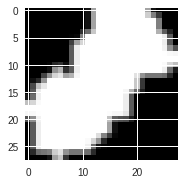

# Modified-MNIST

You are given a dataset of 40,000 images containing MNIST digits. However, each image may contain multiple digits, and each digit will have a different size. Moreover, each digit may have been transformed (rotated, translated, etc.). Finally, each image contains a background which consists of noise.

The task at hand is to **find which number occupies the most space**. (To be perfectly clear, this is not the number with the highiest arithmetic value)

In this task, various pre-processing techniques are implemented (such as normalization, noise reducing, bounding box, resizing, image augmentation, etc) and optimizers (Adam, SGD, and RMSprop). Then the performance of both 4-layer convolutional neural network (CNN) and some existing model architectures (DenseNet, MobileNetV2, Xception, and InceptionResNetV2) are tested. All of the experiments are measured in accuracy using hold-out validation. 

## Preprocessing
### Noise removal (NR)

With the help of *opencv*, a noise removal process is applied. A threshold of 240 is chosen such that all the pixels with a value above the threshold is set to be 255. The method helps the model to better recognize the useful information in the images.

*Original image* | *Image with noise removal*
---|---
 | 

### Image resizing (IR)

The image resizing could lead to a finer description of the object on the image by providing more pixels. However, since the process will lead to an interpolation, thus modification of the raw data, it may introduce some contamination to the dataset. Since some of the pre-trained models with high learning ability need a large image input whose limit exceeds our raw data image, the resizing is actually necessary.

### Bounding box (BB)

In order to provide a higher quality input for the CNN model, we tried to subtract the digit with the largest bounding box. The noise-removed image shows clearer digit boundary, thus is easier for the detector to find the contours. Two techniques are tried: the **rectangle bounding box (RBB)** with resizing and the **square bounding box (SBB)** with fixed box size, whose effects.

*Before bounding* | *rectangle bounding - resizing* | *square bounding - fixed size*
---|---|---
 |  | 

Since that the definition of *the digits occupies the largest bounding box* is hard to precisely define. On the one hand, the definition of the edge affects the area of the bounding box, on the other hand, the rectangle and square bounding box identify different areas and digits on the same figure. Here is an example for the ambiguity (the area occupied by 0 and 1 is ambiguous depending on whether a rectangle or square bounding box is used).

### Image augmentation (IA)

Since the digit in the studied image dataset have different:
- Position;
- Size;
- Rotation angle.
A preprocessing approach to reinforce the performance is proposed using image augmentation. The *ImageDataGenerator* of *Keras* provide for the option of randomly rotating, shifting and zooming the images, which helps to train the model to better handle the above-mentioned problems. However, using this approach leads to a randomized dataset for each execution, such that the exact same result might not be able to reproduce on the same code.

### Preprocessing testing
Different optimizers are validated using different learning rate based on 4-layer CNN after 10 epoches. The validation accuracy is presented.

Techniques | Accuracy | time(s)
---|---|---
raw data | 11.03% | 81
NR | 89.55% | 81
NR,IA | 90.07% | 156
NR,IA,IR | 88.08% | 393
NR,IA,RBB | 90.03% | 156
**NR,IA,SBB** | **94.73%** | 156

## Optimizer testing
Different optimizers are validated using different learning rate based on 4-layer CNN after 20 epoches. Optimizer and learning rate is chosen based on the validation accuracy.

Optimizer\lr | 1E-5 | 1E-4 | 1E-3 | 1E-2 | 1E-1
---|---|---|---|---|---
**Adam**  | 26.35% | 85.03% | **92.03%** | 11.03% | 10.15%
SGD  | 9.13% | 10.33% | 13.38% | 62.38% | 91.83%
RMSprop  | 22.43% | 84.90% | 89.55% | 11.03% | 11.03%

## Pretrained model testing
Validation accuracy is presented for pretrained model architectures.

Model | Accuracy
---|---
DenseNet201 | 96.02%
MobileNetV2 | 95.40%
**Xception** | **96.95%**
InceptionResNetV2 | 94.75%

The tuned **Xception** model is chosen as the best model. The convergence history on training and validation set for the best model is shown.

